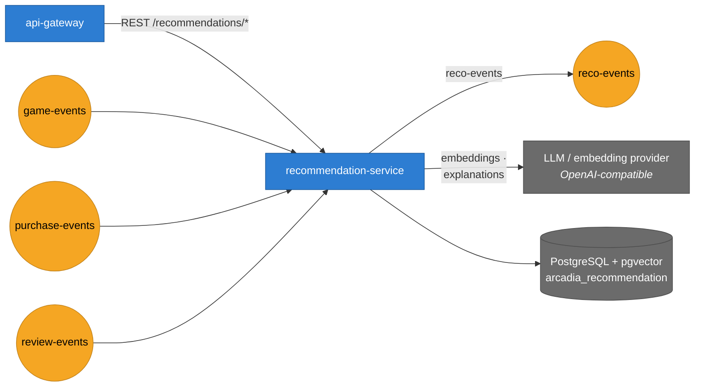

# Arcadia — Recommendation Service

Personalised game recommendations for the [Arcadia](../PHASE01/README.md) platform.
Requirements **§3.1**, the competitive differentiator.

Python 3.14 · FastAPI · PostgreSQL + pgvector · Kafka · Redis · port **8093**

```bash
make install
make run                 # http://localhost:8093/v1/docs
make test                # ruff, then mypy --strict
```

Ranking runs over genre/tag features by default and over semantic embeddings when
`SCORING_BACKEND=dense`; both are ingested either way, so the switch is a restart. Neither needs an
API key to start — see [How the ranking works](#how-the-ranking-works).

---

## What it does

Two questions, answered two different ways:

| | |
|---|---|
| `GET /v1/recommendations` | *What should this user play next?* — hybrid, personalised |
| `GET /v1/games/{id}/similar` | *What else is like this game?* — content only, public |

**This service has no API that changes anything.** Everything it knows arrives on three topics
owned by three other services, and it calls none of them. That is the point: it keeps serving
when Catalog and Store are both down.

```
game-events  ──┐
purchase-events├──▶  ingest  ──▶  taste vectors + ownership
review-events ──┘                         │
                                          ▼
                              batch sweep (every 5 min)
                                          │
                                          ▼
                        recommendations table ──▶ GET /v1/recommendations
                                          │
                                          └──▶ reco-events ──▶ Profile
```

---

## Use cases

| # | Use case | Actor | Notes |
|---|---|---|---|
| 1 | Read own recommendations | Any account | Served from a pre-generated set, never computed in the request |
| 2 | Read another user's recommendations | Support | Same data, for diagnosing a complaint |
| 3 | Read games similar to one game | Anyone | Public — the "more like this" rail on a store page |
| 4 | Refresh everybody's recommendations | Admin / scheduler | The batch |
| 5 | Refresh one user's | Admin | So a demo does not wait for the batch |
| 6 | Ingest a taste signal | Kafka consumers | Purchases, reviews, and published games |

## How it talks to the rest of the platform



| Direction | Peer | Why |
|---|---|---|
| Consumes | `game-events` | The catalogue it recommends from — title, genres, tags, description |
| Consumes | `purchase-events` | The strongest taste signal there is |
| Consumes | `review-events` | A weaker but signed one — a dislike is information too |
| Calls out (optional) | an OpenAI-compatible provider | Embeddings for semantic scoring, and a sentence explaining each suggestion |
| Publishes | `reco-events` | Generation outcomes |

It calls **no sibling service synchronously**. Everything it needs arrives as events, which
is what lets a recommendation be served while half the platform is restarting.

## Infrastructure

| Concern | Choice |
|---|---|
| Language | Python 3.13, FastAPI |
| Storage | PostgreSQL with **pgvector** — `arcadia_recommendation` |
| Messaging | Kafka consumer + outbox |
| Cache | Redis |
| Port | 8093 |
| Deployment | 1 replica, HPA to 4 at 70% CPU |

Every backend is a switch, and each flips independently — the service runs fully offline with
all of them at their defaults:

| Setting | Default | Enabled |
|---|---|---|
| `SCORING_BACKEND` | `sparse` | `dense` — vector similarity |
| `EMBEDDING_BACKEND` | `hashing` | `huggingface` — a real embedding endpoint |
| `EXPLANATION_BACKEND` | `none` | `openai` — an LLM writes the reason |
| `PERSISTENCE_BACKEND` | `memory` | `postgres` |
| `MESSAGING_BACKEND` | `inproc` | `kafka` |

**The PostgreSQL image must carry pgvector.** The migration opens with
`CREATE EXTENSION IF NOT EXISTS vector`; against a stock `postgres` image it fails, the
service logs it and carries on starting, and then reports healthy while every query against
the new columns errors. The platform runs `pgvector/pgvector:pg16` for this reason.

## How the ranking works

### Games and users live in the same space — one of two

Every game gets two content vectors, and `SCORING_BACKEND` picks which one the content half ranks
in. Both are always maintained, so switching is a restart rather than a migration or a re-ingest —
the sweep embeds unembedded games whichever space is configured, which means a catalogue can be
warmed on `sparse` and the switch to `dense` costs nothing. With the default in-process embedder
that is free; against a paid endpoint it is a bill for vectors nobody is reading yet, so set
`EMBEDDING_BACKEND=hashing` if you are staying on `sparse`.

| | `SCORING_BACKEND=sparse` (default) | `SCORING_BACKEND=dense` |
|---|---|---|
| The vector | named features from Catalog's genres and tags — `genre:racing`, `tag:co-op`, namespaced by kind so a genre Catalog validates is not outvoted by a tag nobody curates | a semantic embedding of the title, labels and description, from an embedding model |
| Finds | games sharing labels | games that *are* alike, however they were labelled |
| Explains itself | yes — `reasons` is the shared features | no — see below |
| Needs | nothing | an embedding endpoint, and pgvector |

The dense space exists because the sparse one has a specific, common failure: two racing games
tagged by different developers — `racing`/`arcade` against `motorsport`/`simulation` — share no
feature at all and score exactly **zero** against each other. Requirements §3.1 names both
approaches ("embedding/TF-IDF"), and architecture table row 12 and ER د-۱۲ both specify a `vector`
column; the sparse implementation was the narrower half of what was designed.

What it costs is the explanation. Named dimensions can be intersected, which is where
`"because you like racing games"` came from. Anonymous ones cannot: a coordinate is not a reason.
So a dense deployment produces empty `reasons` unless `EXPLANATION_BACKEND` is set, and that is
deliberately visible rather than papered over with a generated-sounding sentence.

A user's **taste** is the scaled sum of the games they acted on, in whichever space. That is the
whole of "learning" here:

| Signal | Weight | |
|---|---|---|
| `PurchaseCompleted` | `+1.0` | the strongest statement a user makes |
| `ReviewPosted` — LIKE | `+0.5` | only ever left on something already bought; full weight would double-count the game |
| `ReviewPosted` — DISLIKE | `−0.3` | smaller on purpose: one disappointment should not evict a whole genre |

A **gift credits the recipient, not the payer.** Otherwise the platform learns that you love
whatever your friends play, and the recipient's own library stays recommendable back to them.

### Why the signals are remembered, not just summed

A taste vector is a running sum, and a sum cannot be taken apart: once a game is folded in, nothing
recovers which game contributed what. That is fine with one space and fatal with two, because the
two arrive independently — an embedding is a call to a third party, and `PurchaseCompleted` is not
going to wait for it. A game bought before it was embedded contributes nothing to the dense vector.

So each profile also keeps the last 200 actions as `(game, weight)` — the `interaction_history` of
ER د-۱۲ — and the sweep rebuilds the dense vector from them each pass. A late embedding then costs
a recomputation rather than a signal lost for good.

### Two scorers, blended 65 / 35

**Content** — cosine between the user's taste and each game's vector, in whichever space is
configured. Cosine rather than a dot product because magnitudes mean nothing comparable: someone
with forty games has a longer vector than someone with two, and without normalising, every
candidate scores higher for the first user purely on volume.

**Collaborative** — item-item co-purchase, as one Postgres self-join: *everyone who owns what you
own, and what else they own*. Counted by **distinct neighbour**, not by row — otherwise the
ranking is decided by whoever has the largest library rather than by agreement between people.

Counts are shrunk by `count / (count + 5)` rather than normalised against the batch. The first
version normalised against the strongest candidate, which meant a *single* co-buyer scored a
perfect 1.0 — and 0.35 of certainty beat a real genre match at 0.65 × 0.5. The platform's
end-to-end suite caught it recommending a strategy game to a racing fan ahead of another racing
game, on the strength of one person having bought both.

Content is weighted higher deliberately. Collaborative filtering is the better signal once a
platform has density and has nothing to say before that, so this degrades gracefully as the
platform fills up instead of being confidently wrong while it is empty.

### Nothing is recommended that the user owns

Enforced at ranking rather than by the query that produced the candidates, so it holds however a
candidate got into the running — the collaborative half searches *by* co-purchase and would
otherwise happily suggest a game back to one of the very users whose ownership put it there.

### There is no empty answer

A user with no history, or one whose list has not been generated yet, gets **top sellers**,
labelled `source: FALLBACK` in the envelope. The read path has no failure mode that returns
nothing, so a storefront can render the section unconditionally rather than branching on whether
personalisation happened to be available. `purchase_count` is maintained by consuming purchases
rather than asked of Store, so this works during an outage of everything else.

---

## Why generation is a batch

Ranking touches every recommendable game and runs a self-join. Doing that per request would put
it between a user and their storefront against §2's 300ms p95 budget.

So it runs on a schedule (five minutes, matching Marketplace's matching engine so one machine is
not running two unrelated cadences), and a read becomes one indexed lookup. The cost is a list
that is minutes stale, which for a suggestion is not a cost.

`POST /v1/admin/recommendations/refresh` forces a sweep — for an operator investigating a
complaint, and for the end-to-end suite, which would otherwise have to wait five minutes to
assert anything.

The scheduler is **one task per replica, not a singleton.** N replicas do the same work N times;
the sweep is idempotent, so the cost is duplicated CPU rather than a wrong answer. Making it a
genuine singleton needs a distributed lock, which is machinery to add when there is more than one
replica to coordinate.

---

## The ordering problem worth knowing about

`PurchaseCompleted` and `GamePublished` arrive on independent topics, and **on a cold start
replaying history the purchase usually lands first.** A purchase for a game this service cannot
yet describe has nothing to contribute to a taste vector.

Those purchases are recorded as ownership with `counted = false` — so the collaborative half is
never left with a hole — and `GamePublished` credits them when the description turns up.

The dense space has the **same problem one layer down**: a game can be published and bought before
its embedding has been computed, because computing it is an HTTP call the ingest path deliberately
does not wait for. `interaction_history` is that fix, and unlike `counted` it needs no flag —
the vector is rebuilt from the remembered actions on every sweep, so a late embedding repairs
itself.

This was not theoretical. Booting against the platform's real 18 hours of event history produced
19 ownerships and **2** preference profiles. With backfill: 16 ownerships, **14** profiles, zero
uncounted. Without it the content half would have silently done almost nothing on every fresh
deploy.

`test_15_recommendations.py::test_no_signal_was_dropped_for_want_of_a_game` is the guard.

---

## API

| | |
|---|---|
| `GET /v1/recommendations` | the caller's own list · authenticated |
| `GET /v1/users/{id}/recommendations` | another user's · self or Support |
| `GET /v1/games/{id}/similar` | content neighbours · **public** |
| `POST /v1/admin/recommendations/refresh` | force a sweep · Support/Admin |
| `POST /v1/admin/recommendations/users/{id}/refresh` | force one user · Support/Admin |
| `GET /livez` `/readyz` `/metrics` | probes and Prometheus |

`/similar` is public because the answer does not depend on who is asking — it is a property of
the catalogue, which is itself public. Requiring a token would buy nothing and hide the rail from
a logged-out visitor.

Personalised reads are authenticated because the list is derived from what somebody bought, which
makes it a statement about a person rather than about the catalogue.

Every response carries `source` — `CONTENT`, `COLLAB`, `HYBRID` or `FALLBACK` — and each item
carries `reasons`. The score is a float nobody can interpret; "because you like racing games" is
the only part of the answer a user can check.

Where `reasons` comes from depends on configuration: shared features on the sparse path, an
explanation model on the dense one, and **empty** on a dense deployment with
`EXPLANATION_BACKEND=none` — which is the honest answer rather than a fabricated one. A client
must already treat it as optional; that has not changed.

---

## Events

**Consumes** — `game-events` (`GamePublished`, `GameWithdrawn`), `purchase-events`
(`PurchaseCompleted`), `review-events` (`ReviewPosted`). Each has an anti-corruption handler in
`presentation/consumers/`; those services' payload shapes stop there. `GamePublished`'s
`description` is read as well as its genres and tags — it is the richest input the semantic space
has, and the field most likely to be missing, so a game without one is embedded from its title and
labels rather than skipped.

**Produces** — `arcadia.reco.v1.RecommendationGenerated` on `reco-events`, consumed by Profile.
The whole list travels in the event rather than a "come and fetch it" notification, so a
regeneration for every user does not turn into a call back into this service at the moment the
batch is under most load.

Written through a **transactional outbox** in the same transaction as the ranking, and consumed
idempotently — belt and braces, because `purchase_count` only ever increments, so a duplicate
that slipped past both would not raise anything. It would quietly overstate a game's popularity
for ever, and the fallback ranking is built on that number.

---

## Layout

Clean Architecture, dependencies pointing inwards only.

```
domain/          policy/scoring.py is the recommender; policy/embedding.py both vector spaces
application/     use cases + ports; nothing here imports FastAPI or SQLAlchemy
infrastructure/  Postgres, Kafka, Redis, the scheduler, the outbox, the two providers
presentation/    HTTP routers and the three Kafka consumers
composition.py   the only module allowed to import infrastructure.persistence
```

The embedding provider and the explanation model are reached through ports
(`application/ports/outbound/enrichment.py`) with adapters in `infrastructure/adapters/`. That is
§2.8's Anti-Corruption Layer applied to a third party this service chose rather than inherited: no
provider's payload shape reaches past its adapter, and neither the domain nor the use cases know
that HTTP is involved.

`PERSISTENCE_BACKEND`, `MESSAGING_BACKEND`, `CACHE_BACKEND`, `IDENTITY_BACKEND`, `SCORING_BACKEND`,
`EMBEDDING_BACKEND` and `EXPLANATION_BACKEND` each flip independently, so the service still runs
entirely in-process with no infrastructure and no API keys at all. See `.env.example`.

**The sparse embedding is JSONB; the dense one is a pgvector `vector` column.** Both were built and
measured, because the sparse space's own argument — a few dozen named dimensions, scanned in full,
no index worth having — looked like it should carry over.

It does not. Answering one `/v1/games/{id}/similar` over 500 games at 1024 dimensions, JSONB:

| | |
|---|---|
| fetch + JSONB parse | **87 ms** |
| cosine in Python | 32 ms |
| p95 end to end | **147 ms** |

Three quarters of that is deserialising five hundred rows to keep ten, against a §2 budget of 300ms
for the whole request. pgvector stores the same vector in a compact binary form, computes the
distance in the database, and returns the ten — so the cost stops scaling with the catalogue on the
one read that ranks at request time. At 100 games JSONB was a perfectly acceptable 35ms; the point
is that it degrades with exactly the growth this service is supposed to survive.

No ANN index on the column, deliberately. HNSW trades exactness for speed at a scale this catalogue
is nowhere near, and an exact scan of a few hundred binary vectors inside Postgres is already fast.
It becomes worth adding when the numbers above are measured again and the distance query, rather
than the transfer, is what costs.

`EMBEDDING_DIMENSIONS` is the price: it is baked into the `vector(n)` column and its migration, so
pointing at a model of a different width needs a new revision and a re-embedding of the catalogue.
It is also why `pgvector/pgvector:pg16` replaces the stock Postgres image for the whole platform —
a drop-in superset, but a shared component changed for one service's benefit.

---

## Testing

This repository's own pipeline runs `ruff` and `mypy --strict`, then builds the image and boots
it with no database to prove `/readyz` reports 503 rather than lying.

The behaviour is covered by the platform's end-to-end suite,
[`infra/test/e2e/test_15_recommendations.py`](../infra/test/e2e/test_15_recommendations.py) — 24
checks against a running platform:

```bash
cd ../infra && make up && make wait && make e2e
```

That is deliberate rather than a gap. A unit test here can assert that a taste vector moves when a
handler is called. Nothing but a running platform can assert that Catalog still spells the field
`genres`, that Order still carries `recipient_id` rather than only `buyer_id`, or that Review still
sends `sentiment: "LIKE"`. Those three strings are a contract with three repositories and no
compiler checks them — and the same suite is what caught the collaborative scorer's normalisation
bug described above.

---

## Known limitations

**No TF-IDF on the sparse path.** Features there are binary over genres and tags. Inverse document
frequency needs a corpus-wide pass and, at a few dozen games, mostly amplifies noise. It is an IDF
weight on `Embedding.of` when the catalogue is large enough to want it — and moot on the dense
path, which is the other half of what §3.1's "embedding/TF-IDF" offers.

**No matrix factorisation.** Requirements §3.1 says "item-item / MF"; this takes the item-item
branch. MF means a training step, a model artifact and a serving story that no other service on
this platform has.

**Browsing behaviour is still missing.** It is listed as an input in §3.1 and no service currently
emits it. When one does, it is another `SignalKind` and a weight — the history now recorded per
profile means it would also reach the dense vector without further machinery.

**The explanation model is not evaluated.** It is prompted to justify a suggestion only from the
games a user plays and the candidate's own labels, and any game it names that was not asked about
is discarded — so a hallucinated id cannot attach one game's reason to another. Nothing checks that
the sentence it writes is *true* of the game, and nothing can, short of a human reading them.

**A dense re-ranking is not attempted.** The model writes reasons; it does not reorder. That keeps
the ordering deterministic, reproducible and covered by the end-to-end assertions, and keeps the
cost at one call per user per sweep. Letting it rank would change all three.
